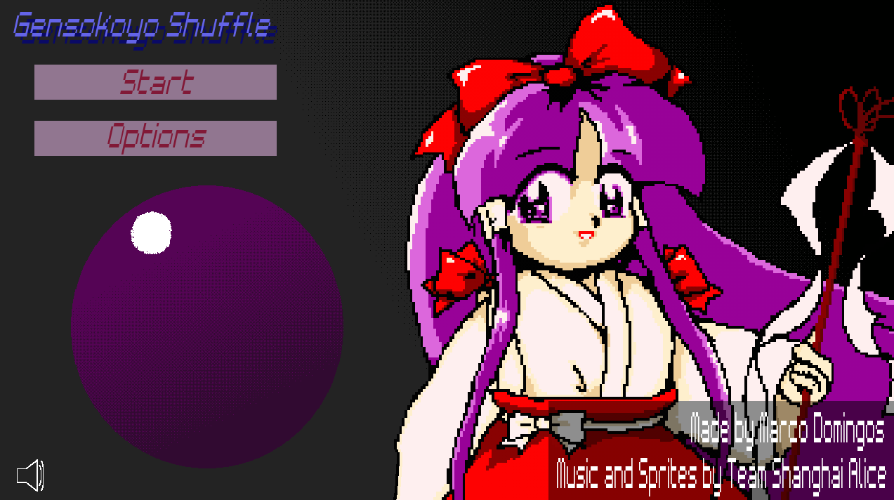

# Gensokoyo Shuffle - A simple game for an university project, made in PyGame

### Project View
This project was made by me as the final project for one of my programming subjects in University. It is Touhou-inspired version of *Mastermind*, the card memorization game. 

### Features
#### Options
While not much, there is a volume slider on this menu if you want to reduce the sound of the music playing in the background

#### Board Menu
There you can select your board size

#### Game Board
Depending on your chosen board size in the Board Menu, the game will present to you a bigger board in which you'll play. There is a point system also, which will add **100 points* each time you turn the right pair of cards. However the more times you turn, the more points you'll lose, in the first time losing only 20, in the second 40, and so on.

#### Folder contents
In this folder you will find the four python files that run the program, folders containing images, sounds and fonts, and an actual executable file of the program.

> Warning: Do not separate the executable from the folder, or it will not be able to load the images.
---
Touhou Project and all its assets are owned by Team Shanghai Alice.